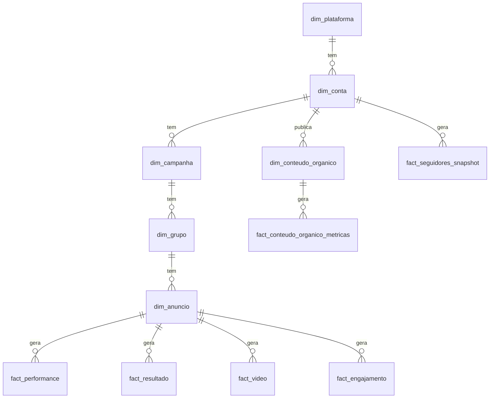

# Spec — Banco de Dados Centralizado de Mídia Paga (multi-canal)

Documento de arquitetura para substituir/evoluir `channel_metrics_daily` por um modelo dimensional
que aguenta granularidade real (nível anúncio), respeita NULL≠0, e é extensível a novas plataformas
sem redesenho. Base para implementação — **este documento não roda nada em produção**, é o projeto.

---

## ETAPA 1 — Diagnóstico crítico do que já existe

O sistema **já tem** uma tabela alimentando Power BI hoje: [`channel_metrics_daily`](../migrations/channel_metrics_daily.sql),
populada por `channelMetricsCollect()` em `functions/dynamic-responder.ts`, exposta a um role
Postgres somente-leitura (`powerbi_reader`, criado direto no Supabase, não versionado) restrito a
essa única tabela. Qualquer arquitetura nova precisa evoluir isso, não descartar.

**O que já funciona e deve ser preservado:**
- Coleta automática via cron para Meta, Google, GA4 (`metaAdsInsights`, `googleAdsInsights`, `ga4DailyBySource`).
- Role read-only dedicado pro Power BI, isolado do resto do banco (financeiro/clientes/senhas).
- Classificação de objetivo por campanha (Meta: `objective`+`optimization_goal`+`destination_type`;
  Google: `advertising_channel_type` + bucket de `conversion_action`).
- Upsert idempotente por chave natural (`unique(client_id, channel, date, source_medium, campaign, adset, ad_content)`).

**Problemas estruturais confirmados no schema atual** (`migrations/channel_metrics_daily.sql:12-23`):

| Problema | Evidência | Consequência |
|---|---|---|
| Todo métrica é `numeric default 0` | `spend numeric default 0`, `purchases numeric default 0`, etc. | Impossível distinguir "Google não reporta `reach`" (hoje hardcoded `reach:0, frequency:0` em `gadsShape`) de "reach foi zero de verdade". CPM/frequência calculados errado se agregados sem filtrar por plataforma. |
| Granularidade parada em conjunto/campanha | Comentário no código: *"Meta/Google: 1 linha por dia × CONJUNTO/GRUPO DE ANÚNCIOS (não por ad — evita explosão de volume)"* | Mas a API **já busca nível anúncio** (`level=ad` no Meta, `ad_group_ad` no Google) — o dado existe e é descartado antes de persistir. Não dá pra saber qual criativo específico performa. |
| `resultados` não existe como conceito — vira `purchases`/`leads`/`conversas` fixos | `channel_metrics_daily.sql:18-21` | Campanha de app install ou cadastro não tem coluna — força gambiarra ou fica de fora. |
| Vídeo/engajamento espremidos em 2 colunas | `video_views`, `engajamentos` | Meta já discrimina ThruPlay vs 3s vs view genérica (`videoViews` em `shape()`) — perdido na gravação. |
| PK é string concatenada | `id text primary key` montado por concatenação | Frágil com caracteres especiais em nome de campanha; sem separação clara entre chave natural e identidade do registro. |
| `source_medium`/`ad_content` só GA4; `adset` só Meta/Google | Colunas condicionais por plataforma | Antecipa exatamente o problema que uma nova plataforma (TikTok/Pinterest) vai reproduzir — mais colunas condicionais a cada integração nova. |
| Seguidores do Instagram não têm série histórica | `instagramListAccounts()` busca `followers_count` ao vivo, direto da Graph API, sem persistir | Impossível calcular "seguidores ganhos no período" sem guardar snapshot diário. |
| `lead_touchpoints` já existe e já tem tudo pra jornada multi-canal | `migrations/jornada_lead.sql` — `channel, source, medium, campaign, adset, ad, term, content, ts, person_id` | Isso **não precisa ser reconstruído** — só falta uma camada de agregação (view) por cima. |

**Conclusão da ETAPA 1:** a arquitetura certa não é "jogar tudo fora e criar do zero" nem "adicionar
mais colunas condicionais em `channel_metrics_daily`". É separar o que hoje está artificialmente
junto (métricas universais vs. resultados dependentes de objetivo vs. vídeo vs. engajamento) em
tabelas fato distintas, e assumir granularidade nível-anúncio como padrão, já que a API entrega isso.

---

## ETAPA 2 — Princípios de design

1. **NULL ≠ 0, sempre.** Uma coluna só recebe `0` quando a plataforma *reportou* zero. Quando a
   plataforma não expõe a métrica (ex.: Google Ads não tem `reach`/`frequency` — hoje mascarado como
   `0` em `gadsShape`), a coluna fica `NULL`. Isso é obrigatório para qualquer média/CPM/CTR agregado
   estar correto no Power BI.
2. **Granularidade = anúncio × dia**, sempre que a plataforma suportar (Meta e Google já suportam,
   confirmado no código — `level=ad` e `ad_group_ad`). Campanha/conjunto são atributos do anúncio
   (via dimensão), não a linha do fato. Isso não é reescrever a coleta — é parar de descartar o
   nível que a API já devolve.
3. **"Resultado" é uma tabela fato própria (long/EAV), não colunas fixas.** Em vez de `purchases`,
   `leads`, `conversas` como colunas, uma linha por `(anúncio, dia, tipo_resultado)`. Cobre qualquer
   objetivo futuro (cadastro, instalação, ligação) sem migração de schema.
4. **Vídeo e engajamento são fatos separados**, não colunas na tabela principal — a maioria dos
   anúncios não é de vídeo; forçar colunas nulas em massa na tabela mais quente do sistema é
   desperdício e reduz legibilidade. Um anúncio sem vídeo simplesmente não tem linha em `fact_video`.
5. **Seguidores é snapshot diário, não "início/fim de período".** Uma linha por conta × dia com o
   total; qualquer delta ("ganhei X seguidores em março") é `fim - início` calculado no Power BI —
   funciona pra qualquer range de data escolhido pelo usuário, sem pré-agregação frágil.
6. **GA4 é um fato à parte, com join fraco (texto), não FK.** GA4 não tem ID de anúncio — tem
   `sessionSourceMedium`/`sessionCampaignName`/`sessionManualAdContent` (texto livre, confirmado em
   `ga4DailyBySource`). Forçar isso numa FK pra `dim_anuncio` seria inventar uma precisão que não
   existe. Fica em tabela própria, relacionável por nome de campanha (aproximado, documentado como tal).
7. **WhatsApp/CRM não duplica o que já existe.** `wa_conversations`/`wa_messages`/`lead_touchpoints`
   já modelam isso na granularidade operacional certa. A camada de mídia só *agrega* (view diária),
   não recria tabelas.
8. **Moeda e timezone: schema pronto, sem conversão prematura.** Cada fato carrega `moeda` (herdada
   da conta no momento da gravação) — hoje sempre BRL, mas a coluna evita migração se isso mudar.
   Timezone não é normalizado pra UTC: a "data" de cada linha é o dia nativo da plataforma (a API já
   agrupa no fuso da conta) — normalizar quebraria o corte diário que a própria plataforma já fez.
9. **Chave natural com `unique()` + PK substituta (uuid), não string concatenada.** Upsert por
   `ON CONFLICT` na chave natural; `id` é só identidade do registro.
10. **Schema Postgres dedicado (`midia`), não `public`.** Mesmo banco (Supabase já hospeda tudo,
    Power BI já conecta nele — não há razão pra infra nova), mas separado das tabelas operacionais.
    `powerbi_reader` passa a ter `SELECT` no schema inteiro (com `ALTER DEFAULT PRIVILEGES`, cobrindo
    tabelas futuras automaticamente), continuando sem acesso a `public` (clientes/financeiro/senhas).

---

## ETAPA 3 — Modelo dimensional

**Dimensões**
- `dim_plataforma` — catálogo extensível (`meta`, `google`, `tiktok`, `pinterest`, `instagram_organico`, `ga4`, `whatsapp`, ...). Nova plataforma = 1 INSERT, nunca uma coluna nova.
- `dim_conta` — 1 linha por conta de anúncio/propriedade/perfil, por cliente, por plataforma. Carrega `moeda` e `timezone`.
- `dim_campanha` — nível campanha, com objetivo bruto (da API) e objetivo classificado (a lógica que já existe em `metaObjetivo`/`googleObjetivo`).
- `dim_grupo` — conjunto (Meta) / grupo de anúncios (Google) — nome genérico pra cobrir ambos.
- `dim_anuncio` — nível anúncio (folha da árvore paga).
- `dim_conteudo_organico` — posts orgânicos (Instagram hoje) — não é filho de campanha, é sua própria árvore.
- Cliente **não é duplicado aqui** — os fatos referenciam `client_id` direto de `public.clients`, sem copiar dado de cliente pro schema `midia` (dado de cliente é inviolável e não deve ser espelhado).

**Fatos**
| Fato | Grão | Por quê é separado |
|---|---|---|
| `fact_performance` | anúncio × dia | Métricas universais (investimento/impressões/cliques/alcance) — quase sempre presentes. |
| `fact_resultado` | anúncio × dia × tipo_resultado | Objetivo-dependente, cardinalidade variável (EAV). |
| `fact_video` | anúncio × dia | Só existe quando o anúncio é de vídeo. |
| `fact_engajamento` | anúncio × dia | `post_engagement` de anúncio pago — separado do orgânico. |
| `fact_conteudo_organico_metricas` | conteúdo orgânico × data de coleta | Curtidas/comentários/alcance de post orgânico — métricas próprias, não comparáveis 1:1 com anúncio pago. |
| `fact_seguidores_snapshot` | conta social × dia | Estoque, não fluxo — nunca foi persistido antes (gap real, confirmado). |
| `fact_analytics_ga4` | cliente × propriedade × dia × origem/mídia/campanha(texto)/conteúdo(texto) | Grão de sessão, join fraco documentado. |
| `vw_whatsapp_diario` (view) | cliente × dia × origem | Agregação sobre `wa_conversations`/`wa_messages` já existentes — não é tabela nova. |
| `vw_jornada_caminhos` (view) | cliente × caminho (sequência de toques) | Sobre `lead_touchpoints` já existente — implementa o requisito de "caminho multi-canal" sem tabela nova. |



---

## ETAPA 4 — Matriz de disponibilidade por plataforma

`✓` = coluna preenchida quando existe dado · `NULL sempre` = plataforma não expõe essa métrica hoje (confirmado no código de coleta) · vazio = não se aplica ao tipo de fato.

| Métrica | Meta Ads | Google Ads | Instagram orgânico | GA4 | WhatsApp |
|---|:---:|:---:|:---:|:---:|:---:|
| investimento | ✓ | ✓ | — | — | — |
| impressões | ✓ | ✓ | (impressões nullable, plataforma não garante) | — | — |
| cliques | ✓ | ✓ | — | — | — |
| alcance | ✓ | **NULL sempre** (não fornecido pela API) | ✓ | — | — |
| frequência | ✓ | **NULL sempre** (não fornecido pela API) | — | — | — |
| resultado (compra/lead/conversa/...) | ✓ (via `actions[]`) | ✓ (via bucket de `conversion_action`) | — | ✓ (evento `purchase`, filtrado) | ✓ (via `stage`) |
| vídeo (thruplay/views) | ✓ | ✓ (`video_trueview_views`) | ✓ (só Reels/vídeo, campo `plays`) | — | — |
| retenção 25/50/75/100% | **NULL sempre** (não coletado hoje — nem Meta nem orgânico expõem isso na API atual) | **NULL sempre** | **NULL sempre** | — | — |
| curtidas/comentários/compartilhamentos/salvos | **NULL sempre** (não existe a nível de anúncio pago) | — | ✓ | — | — |
| seguidores | — | — | ✓ (snapshot novo) | — | — |
| sessões/usuários | — | — | — | ✓ | — |
| moeda por linha | herdada da conta (API não devolve por linha) | herdada da conta (API não devolve por linha) | — | herdada | — |

Isso não é uma limitação da arquitetura nova — é o estado real da coleta hoje, documentado explicitamente
pra não ser confundido com "esquecimento" depois. Onde diz "NULL sempre", é decisão consciente, não bug.

---

## ETAPA 5 — SQL (schema dedicado `midia`)

```sql
create schema if not exists midia;

-- ===== DIMENSÕES =====

create table midia.dim_plataforma (
  id text primary key,               -- 'meta' | 'google' | 'tiktok' | 'pinterest' | 'instagram_organico' | 'ga4' | 'whatsapp'
  nome text not null,
  tipo text not null,                -- 'ads' | 'organico' | 'analytics' | 'crm'
  ativa boolean not null default true
);
insert into midia.dim_plataforma (id, nome, tipo) values
  ('meta','Meta Ads','ads'), ('google','Google Ads','ads'),
  ('instagram_organico','Instagram Orgânico','organico'),
  ('ga4','Google Analytics 4','analytics'), ('whatsapp','WhatsApp','crm')
on conflict (id) do nothing;

create table midia.dim_conta (
  id uuid primary key default gen_random_uuid(),
  client_id text not null references public.clients(id) on delete cascade,
  plataforma_id text not null references midia.dim_plataforma(id),
  conta_externa_id text not null,     -- act_XXXX, customer id, ig business id, ga4 property id...
  nome text not null default '',
  moeda text not null default 'BRL',
  timezone text not null default 'America/Sao_Paulo',
  ativa boolean not null default true,
  criado_em timestamptz not null default now(),
  unique (client_id, plataforma_id, conta_externa_id)
);

create table midia.dim_campanha (
  id uuid primary key default gen_random_uuid(),
  conta_id uuid not null references midia.dim_conta(id) on delete cascade,
  campanha_externa_id text not null,
  nome text not null default '',
  objetivo_bruto text,                 -- objective (Meta) / advertising_channel_type (Google)
  objetivo_tipo text,                  -- classificado: 'trafego'|'conversao'|'engajamento'|'awareness'|...
  objetivo_rotulo text,
  atualizado_em timestamptz not null default now(),
  unique (conta_id, campanha_externa_id)
);

create table midia.dim_grupo (
  id uuid primary key default gen_random_uuid(),
  campanha_id uuid not null references midia.dim_campanha(id) on delete cascade,
  grupo_externo_id text not null,      -- adset_id (Meta) / ad_group.id (Google)
  nome text not null default '',
  otimizacao text,                     -- optimization_goal (Meta) — nullable, Google não tem equivalente direto
  destino text,                        -- destination_type (Meta: MESSENGER/WHATSAPP/INSTAGRAM_DIRECT) — nullable
  unique (campanha_id, grupo_externo_id)
);

create table midia.dim_anuncio (
  id uuid primary key default gen_random_uuid(),
  grupo_id uuid not null references midia.dim_grupo(id) on delete cascade,
  anuncio_externo_id text not null,    -- ad_id (Meta) / ad_group_ad.ad.id (Google)
  nome text not null default '',
  formato text,                        -- media_type/ad.type quando disponível — nullable
  thumbnail_url text,
  criado_em timestamptz not null default now(),
  unique (grupo_id, anuncio_externo_id)
);

create table midia.dim_conteudo_organico (
  id uuid primary key default gen_random_uuid(),
  conta_id uuid not null references midia.dim_conta(id) on delete cascade,
  post_externo_id text not null,
  tipo_midia text,                     -- media_type (IMAGE/VIDEO/CAROUSEL_ALBUM)
  permalink text,
  legenda text,
  publicado_em timestamptz,
  thumbnail_url text,
  unique (conta_id, post_externo_id)
);

-- ===== FATOS =====

create table midia.fact_performance (
  id uuid primary key default gen_random_uuid(),
  anuncio_id uuid not null references midia.dim_anuncio(id) on delete cascade,
  data date not null,
  moeda text not null default 'BRL',
  investimento numeric not null default 0,   -- sempre reportado pela API quando há gasto
  impressoes bigint,                         -- NULL só se a plataforma não reportar nada nesse dia
  cliques bigint,
  alcance bigint,                            -- NULL sempre pra Google Ads (API não fornece)
  frequencia numeric,                        -- NULL sempre pra Google Ads (API não fornece)
  atualizado_em timestamptz not null default now(),
  unique (anuncio_id, data)
);
create index idx_fact_performance_data on midia.fact_performance(data);

create table midia.fact_resultado (
  id uuid primary key default gen_random_uuid(),
  anuncio_id uuid not null references midia.dim_anuncio(id) on delete cascade,
  data date not null,
  tipo_resultado text not null,   -- 'compra'|'lead'|'conversa'|'add_to_cart'|'iniciar_checkout'|'cadastro'|'instalacao'|'ligacao'|'outro'
  quantidade numeric not null default 0,
  valor numeric,                  -- NULL quando o tipo de resultado não tem valor monetário associado (ex.: lead sem preço)
  origem_deteccao text not null,  -- 'meta_actions'|'google_conversion_action'|'manual'
  moeda text not null default 'BRL',
  unique (anuncio_id, data, tipo_resultado)
);
create index idx_fact_resultado_tipo on midia.fact_resultado(tipo_resultado, data);

create table midia.fact_video (
  id uuid primary key default gen_random_uuid(),
  anuncio_id uuid not null references midia.dim_anuncio(id) on delete cascade,
  data date not null,
  visualizacoes bigint,           -- video_view genérico
  thruplay bigint,                -- Meta: video_thruplay_watched_actions
  vis_3s bigint,                  -- Google: video_trueview_views usado como proxy quando thruplay ausente
  ret_25pct numeric, ret_50pct numeric, ret_75pct numeric, ret_100pct numeric,  -- NULL sempre hoje (não coletado ainda)
  tempo_medio_assistido numeric,  -- NULL sempre hoje (não coletado ainda)
  unique (anuncio_id, data)
);

create table midia.fact_engajamento (
  id uuid primary key default gen_random_uuid(),
  anuncio_id uuid not null references midia.dim_anuncio(id) on delete cascade,
  data date not null,
  engajamentos_total bigint,      -- post_engagement (Meta) / engagements (Google)
  unique (anuncio_id, data)
);

create table midia.fact_conteudo_organico_metricas (
  id uuid primary key default gen_random_uuid(),
  conteudo_id uuid not null references midia.dim_conteudo_organico(id) on delete cascade,
  data_coleta date not null,
  curtidas bigint, comentarios bigint, compartilhamentos bigint, salvamentos bigint,
  alcance bigint, visualizacoes bigint,     -- visualizacoes NULL pra post que não é vídeo/reels
  unique (conteudo_id, data_coleta)
);

create table midia.fact_seguidores_snapshot (
  id uuid primary key default gen_random_uuid(),
  conta_id uuid not null references midia.dim_conta(id) on delete cascade,
  data date not null,
  total_seguidores bigint not null,
  unique (conta_id, data)
);

create table midia.fact_analytics_ga4 (
  id uuid primary key default gen_random_uuid(),
  client_id text not null references public.clients(id) on delete cascade,
  propriedade_id text not null,
  data date not null,
  origem text not null default '',      -- sessionSource
  midia_texto text not null default '', -- sessionMedium
  campanha_texto text not null default '', -- sessionCampaignName (join fraco, por nome)
  conteudo_texto text not null default '', -- sessionManualAdContent
  sessoes bigint,
  usuarios bigint,
  compras numeric,
  receita numeric,
  moeda text not null default 'BRL',
  unique (client_id, propriedade_id, data, origem, midia_texto, campanha_texto, conteudo_texto)
);

-- ===== VIEWS (aproveitam o que já existe, sem duplicar tabela) =====

-- WhatsApp/CRM diário, sobre wa_conversations (já existe em public)
create or replace view midia.vw_whatsapp_diario as
select
  client_id,
  date(created_at) as data,
  origin_type,                                   -- 'anuncio' | 'organico'
  count(*) as conversas_iniciadas,
  count(*) filter (where stage in ('mql','sql','comprou','posvenda')) as qualificados,
  count(*) filter (where stage in ('comprou','posvenda')) as vendas
from public.wa_conversations
group by client_id, date(created_at), origin_type;

-- Caminho multi-canal, sobre lead_touchpoints (já existe em public) — requisito da Jornada do Lead
create or replace view midia.vw_jornada_caminhos as
with ordenado as (
  select
    lt.client_id, lt.person_id,
    string_agg(
      '[' || coalesce(lt.channel,'direto') || '] ' || coalesce(lt.campaign, lt.label, lt.kind),
      ' -> ' order by lt.ts
    ) as caminho,
    max(lp.value) as valor_pessoa
  from public.lead_touchpoints lt
  join public.lead_people lp on lp.id = lt.person_id
  group by lt.client_id, lt.person_id
)
select client_id, caminho, count(*) as ocorrencias, sum(valor_pessoa) as valor_total
from ordenado
group by client_id, caminho
order by ocorrencias desc;

-- ===== RLS + acesso Power BI =====
alter table midia.dim_conta enable row level security;
alter table midia.dim_campanha enable row level security;
alter table midia.dim_grupo enable row level security;
alter table midia.dim_anuncio enable row level security;
alter table midia.dim_conteudo_organico enable row level security;
alter table midia.fact_performance enable row level security;
alter table midia.fact_resultado enable row level security;
alter table midia.fact_video enable row level security;
alter table midia.fact_engajamento enable row level security;
alter table midia.fact_conteudo_organico_metricas enable row level security;
alter table midia.fact_seguidores_snapshot enable row level security;
alter table midia.fact_analytics_ga4 enable row level security;
-- mesmo padrão do resto do sistema: app autenticado tem acesso total, isolamento fica no app
do $$ declare t text; begin
  for t in select unnest(array[
    'dim_conta','dim_campanha','dim_grupo','dim_anuncio','dim_conteudo_organico',
    'fact_performance','fact_resultado','fact_video','fact_engajamento',
    'fact_conteudo_organico_metricas','fact_seguidores_snapshot','fact_analytics_ga4'
  ]) loop
    execute format('drop policy if exists midia_auth on midia.%I', t);
    execute format('create policy midia_auth on midia.%I for all to authenticated using (true) with check (true)', t);
  end loop;
end $$;

grant usage on schema midia to powerbi_reader;
grant select on all tables in schema midia to powerbi_reader;
alter default privileges in schema midia grant select on tables to powerbi_reader;
```

---

## ETAPA 6 — Exemplo de linhas (ilustrando NULL ≠ 0)

`fact_performance` — um anúncio Meta (tem alcance) e um Google (não tem):

| anuncio_id | data | investimento | impressoes | cliques | alcance | frequencia |
|---|---|---|---|---|---|---|
| (Meta, "Carrossel Enem") | 2026-08-05 | 142.30 | 8.421 | 231 | 6.900 | 1.22 |
| (Google, "Search Curso") | 2026-08-05 | 88.10 | 1.205 | 94 | **NULL** | **NULL** |

`fact_resultado` — mesmo anúncio Meta gerando dois tipos de resultado no mesmo dia (impossível hoje em `channel_metrics_daily`):

| anuncio_id | data | tipo_resultado | quantidade | valor |
|---|---|---|---|---|
| (Meta, "Carrossel Enem") | 2026-08-05 | conversa | 12 | **NULL** |
| (Meta, "Carrossel Enem") | 2026-08-05 | lead | 3 | **NULL** |
| (Meta, "Carrossel Enem") | 2026-08-05 | compra | 1 | 397.00 |

---

## ETAPA 7 — DAX (Power BI) respeitando NULL

```dax
-- CPM correto: platforms sem impressoes ficam de fora do denominador automaticamente (SUM ignora NULL)
CPM = DIVIDE(SUM(fact_performance[investimento]), SUM(fact_performance[impressoes])) * 1000

-- Alcance médio: só entra Meta/Instagram, Google (NULL) não contamina a média
Alcance Total = SUM(fact_performance[alcance])   -- Postgres/Power BI: SUM ignora NULL nativamente

-- Custo por resultado, flexível a qualquer tipo_resultado escolhido no filtro
Custo por Resultado =
DIVIDE(
  SUM(fact_performance[investimento]),
  CALCULATE(SUM(fact_resultado[quantidade]))
)

-- Seguidores ganhos no período — delta sobre o snapshot diário, funciona pra qualquer range
Seguidores Ganhos =
VAR Inicio = CALCULATE(MIN(fact_seguidores_snapshot[total_seguidores]), FIRSTDATE('Calendario'[Data]))
VAR Fim = CALCULATE(MAX(fact_seguidores_snapshot[total_seguidores]), LASTDATE('Calendario'[Data]))
RETURN Fim - Inicio
```

---

## ETAPA 8 — Checklist de implementação (faseado)

1. **Fase 1 — Schema + dimensões.** Rodar o SQL da ETAPA 5 (schema `midia` + dimensões + fatos vazios) numa branch/staging do Supabase antes de produção. Confirmar `powerbi_reader` enxerga só `midia` + nada de `public`.
2. **Fase 2 — Coletor Meta/Google no nível anúncio.** Adaptar `channelMetricsCollect()` pra gravar em `midia.fact_performance`/`fact_resultado`/`fact_video`/`fact_engajamento` a partir do que `metaAdsInsights`/`googleAdsInsights` **já retornam no nível `ads`** (não precisa nova chamada de API — só parar de descartar o nível anúncio antes de persistir). Rodar em paralelo com `channel_metrics_daily` por 1-2 semanas antes de aposentar a tabela antiga.
3. **Fase 3 — Instagram: snapshot diário de seguidores.** Novo job (cron) que grava 1 linha/dia em `fact_seguidores_snapshot` a partir de `instagramListAccounts()`. Sem isso, todo o resto do módulo orgânico funciona, mas "seguidores ganhos" não.
4. **Fase 4 — Conteúdo orgânico histórico.** Adaptar `instagramOrganicContent()` pra gravar em `dim_conteudo_organico` + `fact_conteudo_organico_metricas` (hoje é fetch ao vivo, sem persistência — decidir se vira série diária real ou só snapshot na primeira coleta de cada post).
5. **Fase 5 — GA4.** `ga4DailyBySource()` já devolve exatamente o shape de `fact_analytics_ga4` — é o mais rápido de migrar.
6. **Fase 6 — Views WhatsApp/Jornada.** Rodar as duas views da ETAPA 5 direto (não dependem de coleta nova, só de tabelas que já existem). Validar `vw_jornada_caminhos` contra um cliente real e comparar com o relatório nativo do Google Ads (print que você mandou) pra conferir se o formato do caminho fica legível.
7. **Fase 7 — Power BI.** Reapontar o relatório existente pras novas tabelas/views, montar `Calendario` (dimensão de data) padrão pra granularidade diária cruzar os fatos.
8. **Fase 8 — Aposentar `channel_metrics_daily`.** Só depois da Fase 2-5 rodando estável em paralelo e validado linha a linha contra os números atuais do Power BI (nenhum número pode "mudar" pro gestor sem explicação).

**Não coberto por este documento (decisão sua, não técnica):** se cada cliente final deve enxergar
só os próprios dados via um Power BI separado (hoje `powerbi_reader` é uma conta única, todos os
clientes misturados — aceitável pra uso interno da agência, mas exigiria RLS por cliente + credencial
por cliente se isso virar produto pro cliente final).
